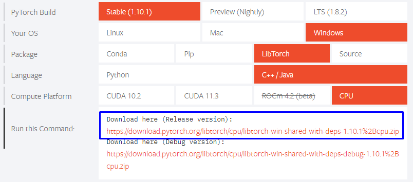

# Simple Motion Matching Implementation
## Screenshots
\


## Build from Source
If you want to build the source code, you should follow the instructions below
-  **Step 1** Run `git submodule update --init` to install all required submodules
-  **Step 2** (Linux) Build the required package and place them in `3rd_party/glfw` and `3rd_party/libtorch`
-  **Step 2** (Windows) Download the pre-complied [GLFW](https://www.glfw.org/download) and [Libtorch](https://pytorch.org/) and place them in `3rd_party/glfw` and `3rd_party/libtorch`


**Now your `3rd_party` directory should look like this**

```
3rd_party
│   FindEigen3.cmake
│   FindGLFW.cmake
│
└───delfem2
└───eigen
└───glfw
└───imguiglfw
│  
│   
└───libglfw
│   │   docs
│   │   include
│   │   lib-mingw-w64
│   │   lib-static-ucrt
│   └── ....
│   
└───libtorch
│   │   bin
│   │   cmake
│   │   include
│   └── ....
│   
```

- **Step 3**(Linux) Build the cmake file in `Source` folder and make sure you complie in release mode
- **Step 3**(Windows) Go to `Source/` run `cmake -S . -B build` the cmake will generate the Vistual Studio solution files inside the `build/` folder.
